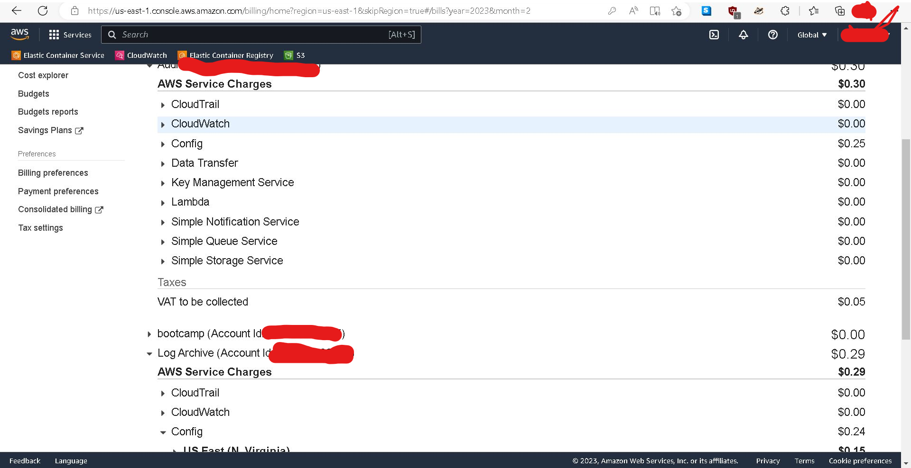

# Week 0 — Billing and Architecture

## Required Homework/Tasks

### Watched Week 0 videos 
- Live Streamed Video, 
- Watched Chirag's Week 0 - Spend Considerations, and
- Watched Ashish's Week 0 - Security Considerations
and several others.

### Recreate Conceptual Diagram in Lucid Charts or on a Napkin
<a href="https://lucid.app/documents/embedded/1dd91479-c503-4542-a9ac-71267e156d73" target="_top">Conceptual Diagram in Lucid App</a>


### Recreate Logical Architectual Diagram in Lucid Charts
<a href="https://lucid.app/documents/embedded/a7e706c5-9898-45b9-b6e7-c6c14808157b" target="_top">Logical Diagram in Lucid App</a>


### Create an Admin User
Followed a tutorial to create an OU and hierarchy of accounts, IAM, ... then used the simpler approach of adding user+group+permissions.
All of them with MFA.

AWS organizational units (OUs)
- projects
  - account IDs

IAM Identity providers AWS SSO (one of them Federated)

### Use CloudShell, Generate AWS Credentials, Installed AWS CLI
Just to test eveything was OK.
Scoop tool use to intall aws-cli on windows environment.

### Create a Billing Alarm
With command ``` aws cloudwatch put-metric-alarm --cli-input-json file://aws-bootcamp-cruddur-2023/aws/json/alarm_config.json --region us-east-1``` 
+ alarm_config.json:
```
{
  "AlarmName": "DailyEstimatedCharges",
  "AlarmDescription": "This alarm would be triggered if the daily estimated charges exceeds 1$",
  "ActionsEnabled": true,
  "AlarmActions": [
      "arn:aws:sns:us-east-1:NNNNNNNNNNNNNNNNNN:billing-alarm"
  ],
  "EvaluationPeriods": 1,
  "DatapointsToAlarm": 1,
  "Threshold": 1,
  "ComparisonOperator": "GreaterThanOrEqualToThreshold",
  "TreatMissingData": "breaching",
  "Metrics": [{
      "Id": "m1",
      "MetricStat": {
          "Metric": {
              "Namespace": "AWS/Billing",
              "MetricName": "EstimatedCharges",
              "Dimensions": [{
                  "Name": "Currency",
                  "Value": "USD"
              }]
          },
          "Period": 86400,
          "Stat": "Maximum"
      },
      "ReturnData": false
  },
  {
      "Id": "e1",
      "Expression": "IF(RATE(m1)>0,RATE(m1)*86400,0)",
      "Label": "DailyEstimatedCharges",
      "ReturnData": true
  }]
}
```


- Pricing plan+Billing Group Global

- [cost management](https://us-east-1.console.aws.amazon.com/cost-management/home?region=us-east-1#/)
- [anomaly detection monitors](https://us-east-1.console.aws.amazon.com/cost-management/home?region=us-east-1#/anomaly-detection/monitors)

+ "Receive Billing Alerts"
+ "Receive Free Tier Usage Alerts"

- [Billing FreeTier](https://us-east-1.console.aws.amazon.com/billing/home?region=us-east-2&skipRegion=true#/freetier)

#### When it was created a not needed Amazon EventBridge Rule

- Wrong decision to activate [AWS ControlTower](https://us-east-1.console.aws.amazon.com/controltower/home/update) because [AWS Config](https://aws.amazon.com/config/pricing/) USE 2-Configuration Items so they were Recorded :
  - 1 year log archive / $0.003 per Configuration Item recorded in US East 1 (N.Virginia) region 102.000 Configuration Item Recorded $0.31
  - 1 year security audit / $0.003 per Configuration Item recorded in US East 2 (Ohio) region 63.000 USE2-ConfigurationItemRecorded $0.19
similar to what happened to [AWS Config Charges](https://serebrov.github.io/html/2019-10-08-aws-config-charges.html)
```
Control tower - landing zone
- Your landing zone is being set up
- AWS Control Tower is setting up the following:

2 organizational units, one for your shared accounts and one for accounts that will be provisioned by your users.
3 shared accounts, which are the management account and isolated accounts for log archive and security audit.
A native cloud directory with preconfigured groups and single sign-on access.
20 preventive controls to enforce policies and 3 detective controls to detect configuration violations.
```

- [AWS Find Resources](https://us-east-2.console.aws.amazon.com/resource-groups/tag-editor/find-resources?region=us-east-2#query=regions:!%28%27AWS::AllSupported%27%29,resourceTypes:!%28%27AWS::AllSupported%27%29,tagFilters:!%28%29,type:TAG_EDITOR_1_0)
- [AWS AWSControlTowerBP Charges 1](https://us-east-1.console.aws.amazon.com/cloudformation/home?region=us-east-1#/stacks/stackinfo?stackId=arn:aws:cloudformation:us-east-1:NNNNNNNNNNNNNNNNNNNNN:stack/AWSControlTowerBP-BASELINE-CONFIG-MASTER/cd4c0500-aa6a-11ed-b41d-0ec442a79d61)
- [AWS AWSControlTowerBP Charges 2](https://us-east-1.console.aws.amazon.com/cloudformation/home?region=us-east-1#/stacks/stackinfo?stackId=arn:aws:cloudformation:us-east-1:NNNNNNNNNNNNNNNNNNNNN:stack/AWSControlTowerBP-BASELINE-CLOUDTRAIL-MASTER/cd303fa0-aa6a-11ed-a0eb-12050885f037)

- [AWS AWSControlTowerBP BaselineCloudTrail Charges ](https://us-east-1.console.aws.amazon.com/cloudtrail/home?region=us-east-1#/trails/arn:aws:cloudtrail:us-east-1:NNNNNNNNNNNNNNNNNNNNN:trail/aws-controltower-BaselineCloudTrail)

**AWS Health Dashboard organizational**

cloudwatch events!!! beware

[Extra Billing](https://us-east-1.console.aws.amazon.com/billing/home?region=us-east-1#/bills?year=2023&month=2)




### Create a Budget

Following wizard **My Zero-Spend Budget** was created.


Also with files
+ budget.json:

```
[
  {
      "Notification": {
          "ComparisonOperator": "GREATER_THAN",
          "NotificationType": "ACTUAL",
          "Threshold": 80,
          "ThresholdType": "PERCENTAGE"
      },
      "Subscribers": [
          {
              "Address": "EMAIL+notification@email.com",
              "SubscriptionType": "EMAIL"
          }
      ]
  }
]
```

+ budget-notifications-with-subscribers.json:
```
{
  "BudgetLimit": {
      "Amount": "10",
      "Unit": "USD"
  },
  "BudgetName": "Example Tag Budget",
  "BudgetType": "COST",
  "CostFilters": {
      "TagKeyValue": [
          "user:Key$value1",
          "user:Key$value2"
      ]
  },
  "CostTypes": {
      "IncludeCredit": true,
      "IncludeDiscount": true,
      "IncludeOtherSubscription": true,
      "IncludeRecurring": true,
      "IncludeRefund": true,
      "IncludeSubscription": true,
      "IncludeSupport": true,
      "IncludeTax": true,
      "IncludeUpfront": true,
      "UseBlended": false
  },
  "TimePeriod": {
      "Start": 1477958399,
      "End": 3706473600
  },
  "TimeUnit": "MONTHLY"
}
```

command was run: ```
aws budgets create-budget --account-id NNNNNNNNNNNNNNNNN --budget file://aws-bootcamp-cruddur-2023/aws/json/budget.json --notifications-with-subscribers  file://aws-bootcamp-cruddur-2023/aws/json/budget-notifications-with-subscribers.json```

