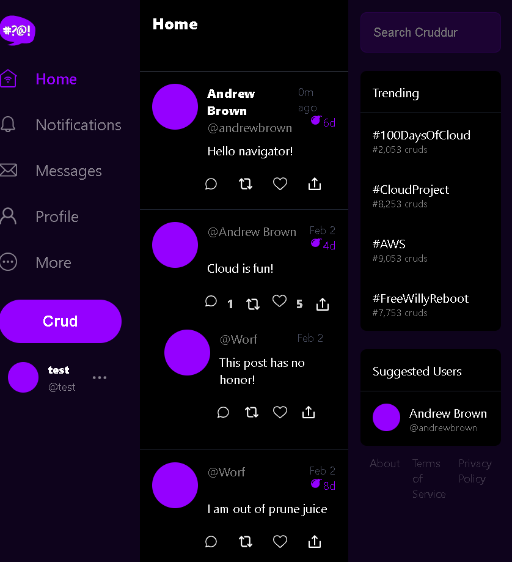

<!-- TOC ignore:true -->
# Week 1 — App Containerization

<!-- TOC -->

- [Week 1 — App Containerization](#week-1--app-containerization)
    - [Required Homework/Tasks](#required-homeworktasks)
        - [Ensure we get the apps running via individual container](#ensure-we-get-the-apps-running-via-individual-container)
            - [- docker images](#--docker-images)
            - [- "docker compose up" under gitpod](#--docker-compose-up-under-gitpod)
            - [- Access to backend](#--access-to-backend)
            - [- Access to frontend](#--access-to-frontend)
        - [Testing dynamodb local installation works](#testing-dynamodb-local-installation-works)
        - [Testing postgresql local installation works](#testing-postgresql-local-installation-works)
    - [Homework challenges](#homework-challenges)
        - [Push and tag an image to DockerHub](#push-and-tag-an-image-to-dockerhub)
        - [Use multi-stage building for a Dockerfile build](#use-multi-stage-building-for-a-dockerfile-build)
        - [Implement a healthcheck in the V3 Docker compose file](#implement-a-healthcheck-in-the-v3-docker-compose-file)
        - [Learn how to install Docker on your localmachine and get the same containers running outside of Gitpod / Codespaces](#learn-how-to-install-docker-on-your-localmachine-and-get-the-same-containers-running-outside-of-gitpod--codespaces)
            - [Frontend-react-js/nodes_modules subfolder](#frontend-react-jsnodes_modules-subfolder)
                - [Solution: /frontend-react-js/nodes_modules subfolder as anonymous volume](#solution-frontend-react-jsnodes_modules-subfolder-as-anonymous-volume)
        - [Best practices](#best-practices)
            - [Using === instead of == and "npm audit fix"](#using--instead-of--and-npm-audit-fix)
            - [npm audit fix](#npm-audit-fix)
            - [static security check](#static-security-check)
                - [checkov run for frontend app](#checkov-run-for-frontend-app)
                - [checkov run for backend app](#checkov-run-for-backend-app)
        - [Deploy in AWS C2 instance](#deploy-in-aws-c2-instance)
            - [Run an Amazon EC2 instance](#run-an-amazon-ec2-instance)
            - [Generate a pem file to access ssh and ssh-permissions-for-private-key from windows](#generate-a-pem-file-to-access-ssh-and-ssh-permissions-for-private-key-from-windows)
            - [Install docker-compose-linux plugin to run docker-compose in the EC2 instance](#install-docker-compose-linux-plugin-to-run-docker-compose-in-the-ec2-instance)
            - [Install git, git clone project repo and run docker-compose as daemon in the EC2 instance](#install-git-git-clone-project-repo-and-run-docker-compose-as-daemon-in-the-ec2-instance)

<!-- /TOC -->

## Required Homework/Tasks

Files commited under their respective folders.

### Ensure we get the apps running via individual container

sh ./backend-flask/run_local.sh
sh ./frontend-react-js/run_local.sh

#### 1.- docker images

```
gitpod /workspace/aws-bootcamp-cruddur-2023 (week-1) $ docker images
REPOSITORY                                       TAG                IMAGE ID       CREATED          SIZE
aws-bootcamp-cruddur-2023-frontend-react-js      latest             d4d0e61caa46   25 minutes ago   1.43GB
aws-bootcamp-cruddur-2023-backend-flask          latest             c617491daa4f   5 hours ago      140MB
postgres                                         13-alpine          55f14697b527   11 days ago      238MB
python                                           3.10-slim-buster   b5d627f77479   13 days ago      118MB
amazon/dynamodb-local                            latest             904626f640dc   2 weeks ago      499MB
node                                             16.18              993a4cf9c1e8   2 months ago     910MB
```

#### 2.- "docker compose up" under gitpod

```
gitpod /workspace/aws-bootcamp-cruddur-2023 (week-1) $ docker compose up
[+] Building 51.3s (9/9) FINISHED                                                 
 => [internal] load build definition from Dockerfile                         0.0s
 => => transferring dockerfile: 171B                                         0.0s
 => [internal] load .dockerignore                                            0.0s
 => => transferring context: 2B                                              0.0s
 => [internal] load metadata for docker.io/library/node:16.18                0.0s
 => [internal] load build context                                           11.2s
 => => transferring context: 239.21MB                                       11.1s
 => CACHED [1/4] FROM docker.io/library/node:16.18                           0.0s
 => [2/4] COPY . /frontend-react-js                                          5.4s
 => [3/4] WORKDIR /frontend-react-js                                         0.0s
 => [4/4] RUN npm ci                                                        24.7s
 => exporting to image                                                       9.8s
 => => exporting layers                                                      9.8s
 => => writing image sha256:d4d0e61caa4687dc427a7ed7c464bf1c9bf0896a79495bc  0.0s 
 => => naming to docker.io/library/aws-bootcamp-cruddur-2023-frontend-react  0.0s 
[+] Running 4/4                                                                   
 ⠿ Container aws-bootcamp-cruddur-2023-db-1                 Created          0.0s 
 ⠿ Container dynamodb-local                                 Created          0.0s
 ⠿ Container aws-bootcamp-cruddur-2023-backend-flask-1      Created          0.0s
 ⠿ Container aws-bootcamp-cruddur-2023-frontend-react-js-1  Recreated        0.0s
Attaching to aws-bootcamp-cruddur-2023-backend-flask-1, aws-bootcamp-cruddur-2023-db-1, aws-bootcamp-cruddur-2023-frontend-react-js-1, dynamodb-local
aws-bootcamp-cruddur-2023-db-1                 | 
...
dynamodb-local                                 | DbPath:        ./data
aws-bootcamp-cruddur-2023-backend-flask-1      | 'FLASK_ENV' is deprecated and will not be used in Flask 2.3. Use 'FLASK_DEBUG' instead.
...
[DEP_WEBPACK_DEV_SERVER_ON_AFTER_SETUP_MIDDLEWARE] DeprecationWarning: 'onAfterSetupMiddleware' option is deprecated. Please use the 'setupMiddlewares' option.
aws-bootcamp-cruddur-2023-frontend-react-js-1  | (Use `node --trace-deprecation ...` to show where the warning was created)
aws-bootcamp-cruddur-2023-frontend-react-js-1  | (node:44) [DEP_WEBPACK_DEV_SERVER_ON_BEFORE_SETUP_MIDDLEWARE] DeprecationWarning: 'onBeforeSetupMiddleware' option is deprecated. Please use the 'setupMiddlewares' option.
aws-bootcamp-cruddur-2023-frontend-react-js-1  | Starting the development server...
aws-bootcamp-cruddur-2023-frontend-react-js-1  |
```

#### 3.- Access to backend

<https://4567-XXXXX-awsbootcampcrudd-YYYY.ws-euxx.gitpod.io/api/activities/home>

```
[
  {
    "created_at": "2023-02-20T23:13:34.246777+00:00",
    "expires_at": "2023-02-27T23:13:34.246777+00:00",
    "handle": "Andrew Brown",
    "likes_count": 5,
    "message": "Cloud is fun!",
    "replies": [
      {
        "created_at": "2023-02-20T23:13:34.246777+00:00",
        "handle": "Worf",
        "likes_count": 0,
        "message": "This post has no honor!",
        "replies_count": 0,
        "reply_to_activity_uuid": "68f126b0-1ceb-4a33-88be-d90fa7109eee",
        "reposts_count": 0,
        "uuid": "26e12864-1c26-5c3a-9658-97a10f8fea67"
      }
    ],
    "replies_count": 1,
    "reposts_count": 0,
    "uuid": "68f126b0-1ceb-4a33-88be-d90fa7109eee"
  },
  {
    "created_at": "2023-02-15T23:13:34.246777+00:00",
    "expires_at": "2023-03-03T23:13:34.246777+00:00",
    "handle": "Worf",
    "likes": 0,
    "message": "I am out of prune juice",
    "replies": [],
    "uuid": "66e12864-8c26-4c3a-9658-95a10f8fea67"
  },
  {
    "created_at": "2023-02-22T22:13:34.246777+00:00",
    "expires_at": "2023-02-23T11:13:34.246777+00:00",
    "handle": "Garek",
    "likes": 0,
    "message": "My dear doctor, I am just simple tailor",
    "replies": [],
    "uuid": "248959df-3079-4947-b847-9e0892d1bab4"
  }
]
```

#### 4.- Access to frontend

<https://XXXX-apenav-awsbootcampcrudd-YYYY.ws-euxx.gitpod.io/>

Able to sign up and sign in


### Testing dynamodb local installation works

<https://github.com/100DaysOfCloud/challenge-dynamodb-local>

```
gitpod /workspace/aws-bootcamp-cruddur-2023 (week-1) $ export AWS_DEFAULT_REGION=us-east-1
gitpod /workspace/aws-bootcamp-cruddur-2023 (week-1) $ export AWS_ACCESS_KEY_ID=KE
gitpod /workspace/aws-bootcamp-cruddur-2023 (week-1) $ export AWS_SECRET_ACCESS_KEY=4
gitpod /workspace/aws-bootcamp-cruddur-2023 (week-1) $ aws dynamodb create-table     --endpoint-url http://localhost:8000     --table-name Music     --attribute-definitions         AttributeName=Artist,AttributeType=S         AttributeName=SongTitle,AttributeType=S     --key-schema AttributeName=Artist,KeyType=HASH AttributeName=SongTitle,KeyType=RANGE     --provisioned-throughput ReadCapacityUnits=1,WriteCapacityUnits=1     --table-class STANDARD
{
    "TableDescription": {
        "AttributeDefinitions": [
            {
                "AttributeName": "Artist",
                "AttributeType": "S"
            },
            {
                "AttributeName": "SongTitle",
                "AttributeType": "S"
            }
        ],
        "TableName": "Music",
        "KeySchema": [
            {
                "AttributeName": "Artist",
                "KeyType": "HASH"
            },
            {
                "AttributeName": "SongTitle",
                "KeyType": "RANGE"
            }
        ],
        "TableStatus": "ACTIVE",
        "CreationDateTime": "2023-02-22T23:25:52.681000+00:00",
        "ProvisionedThroughput": {
            "LastIncreaseDateTime": "1970-01-01T00:00:00+00:00",
            "LastDecreaseDateTime": "1970-01-01T00:00:00+00:00",
            "NumberOfDecreasesToday": 0,
            "ReadCapacityUnits": 1,
            "WriteCapacityUnits": 1
        },
        "TableSizeBytes": 0,
        "ItemCount": 0,
        "TableArn": "arn:aws:dynamodb:ddblocal:000000000000:table/Music"
    }
}
gitpod /workspace/aws-bootcamp-cruddur-2023 (week-1) $ aws dynamodb put-item \
>     --endpoint-url http://localhost:8000 \
>     --table-name Music \
>     --item \
>         '{"Artist": {"S": "No One You Know"}, "SongTitle": {"S": "Call Me Today"}, "AlbumTitle": {"S": "Somewhat Famous"}}' \
>     --return-consumed-capacity TOTAL  
{
    "ConsumedCapacity": {
        "TableName": "Music",
        "CapacityUnits": 1.0
    }
}
```

### Testing postgresql local installation works

```
gitpod /workspace/aws-bootcamp-cruddur-2023 (week-1) $ psql -h localhost -U postgres
Password for user postgres: 
psql (13.10 (Ubuntu 13.10-1.pgdg20.04+1))
Type "help" for help.

postgres=# \l
                                 List of databases
   Name    |  Owner   | Encoding |  Collate   |   Ctype    |   Access privileges   
-----------+----------+----------+------------+------------+-----------------------
 postgres  | postgres | UTF8     | en_US.utf8 | en_US.utf8 | 
 template0 | postgres | UTF8     | en_US.utf8 | en_US.utf8 | =c/postgres          +
           |          |          |            |            | postgres=CTc/postgres
 template1 | postgres | UTF8     | en_US.utf8 | en_US.utf8 | =c/postgres          +
           |          |          |            |            | postgres=CTc/postgres
(3 rows)
```

## Homework challenges

### Push and tag an image to DockerHub

```
docker tag aws-bootcamp-cruddur-2023-frontend-react-js:latest apenav/aws-bootcamp-cruddur-2023-frontend-react-js:latest
docker push apenav/aws-bootcamp-cruddur-2023-frontend-react-js:latest
```

<https://hub.docker.com/repository/docker/apenav/aws-bootcamp-cruddur-2023-frontend-react-js/general>

```
docker tag aws-bootcamp-cruddur-2023-backend-flask:latest apenav/aws-bootcamp-cruddur-2023-backend-flask:latest
docker push apenav/aws-bootcamp-cruddur-2023-backend-flask:latest
```

<https://hub.docker.com/repository/docker/apenav/aws-bootcamp-cruddur-2023-backend-flask/general>

### Use multi-stage building for a Dockerfile build

[../../backend-flask/Dockerfile][https://raw.githubusercontent.com/apenav/aws-bootcamp-cruddur-2023/week-1/backend-flask/Dockerfile]

```
FROM python:3.10-slim-buster as base

FROM base as builder

## virtualenv setup
ENV VIRTUAL_ENV=/opt/venv
RUN python3 -m venv $VIRTUAL_ENV
ENV PATH="$VIRTUAL_ENV/bin:$PATH"

# Inside Container
# make a new folder inside container
WORKDIR /backend-flask

# Outside Container -> Inside Container
# this contains the libraries want to install to run the app
COPY requirements.txt requirements.txt

# Inside Container
# Install the python libraries used for the app
RUN pip3 install -r requirements.txt

# Outside Container -> Inside Container
# . means everything in the current directory
# first period . - /backend-flask (outside container)
# second period . /backend-flask (inside container)
COPY . .

FROM base as runtime
# Set Enviroment Variables (Env Vars)
# Inside Container and wil remain set when the container is running
ENV FLASK_ENV=development
# Create user to run as
RUN adduser --disabled-password unprivil
WORKDIR /backend-flask
RUN chown -R unprivil:unprivil .

COPY --from=builder /opt/venv /opt/venv

ENV PATH="/opt/venv/bin:$PATH"
USER unprivil

EXPOSE ${PORT}

# CMD (Command)
# python3 -m flask run --host=0.0.0.0 --port=4567
CMD [ "python3", "-m" , "flask", "run", "--host=0.0.0.0", "--port=4567"]
```

### Implement a healthcheck in the V3 Docker compose file

```
    healthcheck:
      test: curl --fail http://localhost:3000 || exit 1
      interval: 60s
      retries: 5
      start_period: 20s
      timeout: 10s
```

### Learn how to install Docker on your localmachine and get the same containers running outside of Gitpod / Codespaces

First modify internal variables so they access localhost ports.
[../../docker-compose.yml](https://raw.githubusercontent.com/apenav/aws-bootcamp-cruddur-2023/week-1/docker-compose.yml)

```
version: "3.8"
services:
  backend-flask:
    environment:
      FRONTEND_URL: "http://localhost:3000"
      BACKEND_URL: "http://localhost:4567"
    build: ./backend-flask
    ports:
      - "4567:4567"
    volumes:
      - ./backend-flask:/backend-flask
  frontend-react-js:
    environment:
      REACT_APP_BACKEND_URL: "http://localhost:4567"
    build: ./frontend-react-js
    ports:
      - "3000:3000"
    volumes:
      - ./frontend-react-js:/frontend-react-js
      - /frontend-react-js/node_modules
  dynamodb-local:
    # https://stackoverflow.com/questions/67533058/persist-local-dynamodb-data-in-volumes-lack-permission-unable-to-open-databa
    # We needed to add user:root to get this working.
    user: root
    command: "-jar DynamoDBLocal.jar -sharedDb -dbPath ./data"
    image: "amazon/dynamodb-local:latest"
    container_name: dynamodb-local
    ports:
      - "8000:8000"
    volumes:
      - "./docker/dynamodb:/home/dynamodblocal/data"
    working_dir: /home/dynamodblocal
  db:
    image: postgres:13-alpine
    restart: always
    environment:
      - POSTGRES_USER=postgres
      - POSTGRES_PASSWORD=password
    ports:
      - '5432:5432'
    volumes:
      - db:/var/lib/postgresql/data

# the name flag is a hack to change the default prepend folder
# name when outputting the image names
networks:
  internal-network:
    driver: bridge
    name: cruddur

volumes:
  db:
    driver: local
```

#### Frontend-react-js/nodes_modules subfolder

Just noticed it's not possible to install the default Dockerfile for **frontend-react-js** app with **"npm ci"** or deploy the whole app in an alternative docker computer (apart of gitpod), because it needs cached files under ./frontend-react-js/nodes_modules/ folder (i.e. the result of a previous local execution of **"npm install"** outside docker).

See e.g.
<https://stackoverflow.com/questions/50920521/sh-1-react-scripts-not-found-in-docker>

##### Solution: /frontend-react-js/nodes_modules subfolder as anonymous volume

With **"docker compose build"** rebuilds all docker images and set the cache subfolder /frontend-react-js/nodes_modules as **anonymous volume**.

```
    volumes:
      - ./frontend-react-js:/frontend-react-js
      - /frontend-react-js/node_modules
```

See
<https://docs.docker.com/storage/volumes/>

### Best practices

#### Using === instead of == and "npm audit fix"

The recommended fixes by **npm** were discarded because they disable the backend rendering inside frontend webpage.

#### npm audit fix

Also discarded **npm audit fix** because incompatible changes.

#### static security check

With hadolint for dockerfiles and checkov.

So after
 docker pull bridgecrew/checkov

##### checkov run for frontend app

```
gitpod /workspace/aws-bootcamp-cruddur-2023 (week-1) $ docker run --tty --volume /workspace/aws-bootcamp-cruddur-2023/frontend-react-js:/frontend-react-js --workdir /frontend-react-js bridgecrew/checkov --directory /frontend-react-js

       _               _              
   ___| |__   ___  ___| | _______   __
  / __| '_ \ / _ \/ __| |/ / _ \ \ / /
 | (__| | | |  __/ (__|   < (_) \ V / 
  \___|_| |_|\___|\___|_|\_\___/ \_/  
                                      
By bridgecrew.io | version: 2.3.39 

dockerfile scan results:

Passed checks: 19, Failed checks: 2, Skipped checks: 0

Check: CKV_DOCKER_11: "Ensure From Alias are unique for multistage builds."
        PASSED for resource: /Dockerfile.
        File: /Dockerfile:1-11
        Guide: https://docs.bridgecrew.io/docs/ensure-docker-from-alias-is-unique-for-multistage-builds
...
Check: CKV_DOCKER_3: "Ensure that a user for the container has been created"
        FAILED for resource: /Dockerfile.
        File: /Dockerfile:1-11
        Guide: https://docs.bridgecrew.io/docs/ensure-that-a-user-for-the-container-has-been-created

                1  | FROM node:16.18
                2  | 
                3  | ENV PORT=3000
                4  | COPY . /frontend-react-js
                5  | WORKDIR /frontend-react-js
                6  | 
                7  | RUN npm install
                8  | #RUN npm audit fix
                9  | #RUN npm audit fix --force
                10 | EXPOSE ${PORT}
                11 | CMD ["npm", "start"]

```

##### checkov run for backend app

```
gitpod /workspace/aws-bootcamp-cruddur-2023 (week-1) $ docker run --tty --volume /workspace/aws-bootcamp-cruddur-2023/backend-flask:/backend-flask --workdir /backend-flask bridgecrew/checkov --directory /backend-flask

       _               _              
   ___| |__   ___  ___| | _______   __
  / __| '_ \ / _ \/ __| |/ / _ \ \ / /
 | (__| | | |  __/ (__|   < (_) \ V / 
  \___|_| |_|\___|\___|_|\_\___/ \_/  
                                      
By bridgecrew.io | version: 2.3.39 

dockerfile scan results:

Passed checks: 60, Failed checks: 1, Skipped checks: 0

...
openapi scan results:

Passed checks: 1, Failed checks: 2, Skipped checks: 0

Check: CKV_OPENAPI_3: "Ensure that security schemes don't allow cleartext credentials over unencrypted channel - version 3.x.y files"
        PASSED for resource: components
        File: /openapi-3.0.yml:1-256
        Guide: https://docs.bridgecrew.io/docs/ensure-that-security-schemes-dont-allow-cleartext-credentials-over-unencrypted-channel
Check: CKV_OPENAPI_4: "Ensure that the global security field has rules defined"
        FAILED for resource: security
        File: /openapi-3.0.yml:1-256
        Guide: https://docs.bridgecrew.io/docs/ensure-that-the-global-security-field-has-rules-defined

                Code lines for this resource are too many. Please use IDE of your choice to review the file.
Check: CKV_OPENAPI_5: "Ensure that security operations is not empty."
        FAILED for resource: security
        File: /openapi-3.0.yml:1-256
        Guide: https://docs.bridgecrew.io/docs/ensure-that-security-operations-is-not-empty

                Code lines for this resource are too many. Please use IDE of your choice to review the file.

```

### Deploy in AWS C2 instance

#### Run an Amazon EC2 instance

Run an Amazon EC2 Micro instance with an Amazon ECS-Optimized Amazon Linux AMI for accomplish Free Tier.
Amazon ECS-Optimized Amazon Linux AMI By: Amazon Web Services Latest Version: 2018.03.20221115
<https://aws.amazon.com/marketplace/pp/prodview-2l3oufmhdyhrg>

Open tcp/3000 port in assigned Security Group.

#### Generate a pem file to access ssh and ssh-permissions-for-private-key from windows

After generate and download a pem file to access ssh it's mandatory to fix its permissions for making private key because file permisions are too open.
See the solution for a windows environment:

<https://superuser.com/questions/1296024/windows-ssh-permissions-for-private-key-are-too-open>

#### Install docker-compose-linux plugin to run docker-compose in the EC2 instance

```
DOCKER_CONFIG=${DOCKER_CONFIG:-$HOME/.docker}
mkdir -p $DOCKER_CONFIG/cli-plugins
curl -SL https://github.com/docker/compose/releases/download/v2.16.0/docker-compose-linux-x86_64 -o $DOCKER_CONFIG/cli-plugins/
chmod +x $DOCKER_CONFIG/cli-plugins/docker-compose
docker-compose version
```
See
<https://docs.docker.com/compose/install/linux/>

#### Install git, git clone project repo and run docker-compose as daemon in the EC2 instance

```
ssh -i "docker.pem" ec2-user@ec2-XX.XX.XX.XX.compute-1.amazonaws.com
Last login: Fri Feb 24 19:40:32 2023 from XX.XX.XX.XX

   __|  __|  __|
   _|  (   \__ \   Amazon Linux 2 (ECS Optimized)
 ____|\___|____/

For documentation, visit http://aws.amazon.com/documentation/ecs
12 package(s) needed for security, out of 20 available
Run "sudo yum update" to apply all updates.
[ec2-user@ip- ~]$ sudo yum install git
[ec2-user@ip- ~]$ git clone https://github.com/apenav/aws-bootcamp-cruddur-2023
[ec2-user@ip- ~]$ cd aws-bootcamp-cruddur-2023
[ec2-user@ip- ~]$ docker-compose up -d
```
