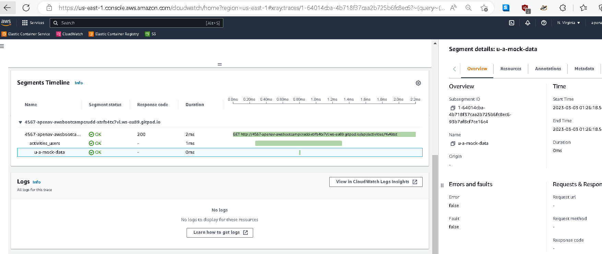

<!-- TOC ignore:true -->
# Week 2 — Distributed Tracing

<!-- TOC -->

- [Week 2 — Distributed Tracing](#week-2--distributed-tracing)
    - [Required Homework/Tasks](#required-homeworktasks)
    - [Instrument Honeycomb with Open Telemetry OTEL](#instrument-honeycomb-with-open-telemetry-otel)
    - [Instrument AWS X-Ray](#instrument-aws-x-ray)
        - [AWS X-Ray Create group](#aws-x-ray-create-group)
        - [AWS X-Ray Creating sampling rule](#aws-x-ray-creating-sampling-rule)
        - [AWS X-Ray logs insights](#aws-x-ray-logs-insights)
        - [subsegment with http error 40x in AWS X-Ray](#subsegment-with-http-error-40x-in-aws-x-ray)
        - [subsegment with http error 50x in AWS X-Ray](#subsegment-with-http-error-50x-in-aws-x-ray)
        - [Timeline view of subsegments recorded](#timeline-view-of-subsegments-recorded)
        - [xray traces servicemap](#xray-traces-servicemap)
            - [xray traces subsegments](#xray-traces-subsegments)
    - [Configure custom logger to send to CloudWatch Logs](#configure-custom-logger-to-send-to-cloudwatch-logs)
    - [Integrate Rollbar and capture an error](#integrate-rollbar-and-capture-an-error)
    - [Homework challenges](#homework-challenges)
        - [Add custom instrumentation to Honeycomb to add more attributes eg. UserId, Add a custom span](#add-custom-instrumentation-to-honeycomb-to-add-more-attributes-eg-userid-add-a-custom-span)
        - [Run custom queries in Honeycomb and save them later eg. Latency by UserID, Recent Traces](#run-custom-queries-in-honeycomb-and-save-them-later-eg-latency-by-userid-recent-traces)
            - [Saved queries](#saved-queries)
            - [Gitpod Log:](#gitpod-log)

<!-- /TOC -->

## Required Homework/Tasks

Files commited under their respective folders.

[week2 variables shellscript file (to be set with real values)](https://raw.githubusercontent.com/apenav/aws-bootcamp-cruddur-2023/week-2/journal/assets/week2variables.sh)

NOTE: **us-east-1** was used as default AWS region instead of ca-central-1

After decision to remove both databases in local environment, orphans docker images were removed:

```
gitpod /workspace/aws-bootcamp-cruddur-2023 (week-2) $ docker compose down  --remove-orphans
[+] Running 5/5
 ✔ Container frontend-react-js                        Removed                                                 0.0s 
 ✔ Container aws-bootcamp-cruddur-2023-xray-daemon-1  Removed                                                 0.0s 
 ✔ Container backend-flask                            Removed                                                 0.0s 
 ✔ Container aws-bootcamp-cruddur-2023-db-1           Removed                                                 0.0s 
 ✔ Network aws-bootcamp-cruddur-2023_default          Removed                                                 0.1s 
```

There have been encountered a lot of difficulties to complete the homework, among others:

- Make all of [Honeycomb](https://ui.honeycomb.io/XXXX-gettingstarted/environments/test/datasets/backend-flask), [X-Ray](https://us-east-1.console.aws.amazon.com/cloudwatch/home?region=us-east-1#xray:traces/1-XX-XXX?~(query~(filter~(node~'XX-XX-XX-X-X))~context~(xrayGroup~'~timeRange~(delta~3600000)))), [Cloudwatch](https://us-east-1.console.aws.amazon.com/cloudwatch/home?region=us-east-1#home:) and [Rollbar](https://rollbar.com/XXXX/?sort=total&environments=production&levels=10&levels=20&levels=30&levels=40&levels=50&duration=7d&tz=Continent%2FCity&projects=617964&from=2023-03-02T11%3A00%3A00%2B01%3A00&to=2023-03-04T11%3A20%3A17%2B01%3A00&order=desc) observability tools work together in gitpod environment with the code.

- Repeatedly having an error about expired token with a SSO type account AWS user, stop using it with nother AWS user as a workaround.

## Instrument Honeycomb with Open Telemetry (OTEL)

<http://honeycomb-whoami.glitch.me/> When in doubt about being correctly configured the honeycomb api token.

See snapshots under [Homework challenges](#homework-challenges)

## Instrument AWS X-Ray

```

[+] Running 3/0
 ✔ Container aws-bootcamp-cruddur-2023-xray-daemon-1  Recreated                                               0.0s 
 ✔ Container backend-flask                            Created                                                 0.0s 
 ✔ Container frontend-react-js                        Created                                                 0.0s 
Attaching to aws-bootcamp-cruddur-2023-xray-daemon-1, backend-flask, frontend-react-js
aws-bootcamp-cruddur-2023-xray-daemon-1  | 2023-02-28T20:11:15Z [Info] Initializing AWS X-Ray daemon 3.3.6
aws-bootcamp-cruddur-2023-xray-daemon-1  | 2023-02-28T20:11:15Z [Info] Using buffer memory limit of 643 MB
aws-bootcamp-cruddur-2023-xray-daemon-1  | 2023-02-28T20:11:15Z [Info] 10288 segment buffers allocated
aws-bootcamp-cruddur-2023-xray-daemon-1  | 2023-02-28T20:11:15Z [Info] Using region: us-east-1
frontend-react-js                        | 
frontend-react-js                        | > frontend@0.1.0 start
frontend-react-js                        | > react-scripts start
frontend-react-js                        | 
backend-flask                            | 'FLASK_ENV' is deprecated and will not be used in Flask 2.3. Use 'FLASK_DEBUG' instead.
...                      | 
```

### AWS X-Ray Create group

```
 aws xray create-group    --group-name "Cruddur"    --filter-expression "service(\"$FLASK_ADDRESS\") {fault OR error}" --region us-east-1
{
    "Group": {
        "GroupName": "Cruddur",
        "GroupARN": "arn:aws:xray:us-east-1:XXX:group/Cruddur/ZZZZZZ",
        "FilterExpression": "service(\"https://4567-XXXX-awsbootcampcrudd-xtrfs4tx7vl.ws-eu89.gitpod.io\") {fault OR error}",
        "InsightsConfiguration": {
            "InsightsEnabled": false,
            "NotificationsEnabled": false
        }
    }
}

```

### AWS X-Ray Creating sampling rule

```

 aws xray create-sampling-rule --cli-input-json file://aws/json/xray.json --region us-east-1
{
    "SamplingRuleRecord": {
        "SamplingRule": {
            "RuleName": "Cruddur",
            "RuleARN": "arn:aws:xray:us-east-1:XXX:sampling-rule/Cruddur",
            "ResourceARN": "*",
            "Priority": 9000,
            "FixedRate": 0.1,
            "ReservoirSize": 5,
            "ServiceName": "backend-flask",
            "ServiceType": "*",
            "Host": "*",
            "HTTPMethod": "*",
            "URLPath": "*",
            "Version": 1,
            "Attributes": {}
        },
        "CreatedAt": "2023-02-28T19:30:37+00:00",
        "ModifiedAt": "2023-02-28T19:30:37+00:00"
    }
}
```

NOTE: once a "GroupName" such as "Cruddur" exists, there´s no way to delete it.

### AWS X-Ray logs insights


### subsegment with http error 40x in AWS X-Ray


### subsegment with http error 50x in AWS X-Ray


### Timeline view of subsegments recorded


### xray traces servicemap


#### xray traces subsegments




NOTE: Recognizing the excellent work done by Ollie
<https://olley.hashnode.dev/aws-free-cloud-bootcamp-instrumenting-aws-x-ray-subsegments>

## Configure custom logger to send to CloudWatch Logs


[./assets/logs-insights-results.json](https://raw.githubusercontent.com/apenav/aws-bootcamp-cruddur-2023/week-2/journal/assets/week2-cloudwatch-logs-activities-logs-insights-results.json) and
[logs insights results json file](assets/week2-cloudwatch-logs-activities-logs-insights-results.json)

```

2023-02-28T22:58:02Z [Info] Initializing AWS X-Ray daemon 3.3.6
2023-02-28T22:58:02Z [Info] Using buffer memory limit of 643 MB
2023-02-28T22:58:02Z [Info] 10288 segment buffers allocated
2023-02-28T22:58:02Z [Info] Using region: us-east-1
2023-02-28T22:58:11Z [Error] Get instance id metadata failed: RequestError: send request failed
caused by: Get "http://169.254.169.254/latest/meta-data/instance-id": context deadline exceeded (Client.Timeout exceeded while awaiting headers)
2023-02-28T22:58:11Z [Info] HTTP Proxy server using X-Ray Endpoint : https://xray.us-east-1.amazonaws.com
2023-02-28T22:58:11Z [Info] Starting proxy http server on 0.0.0.0:2000
2023-02-28T22:58:17Z [Info] Successfully sent batch of 1 segments (0.387 seconds)
2023-02-28T23:00:46Z [Info] Got shutdown signal: terminated
2023-02-28T23:05:18Z [Info] Initializing AWS X-Ray daemon 3.3.6
2023-02-28T23:05:18Z [Info] Using buffer memory limit of 643 MB
2023-02-28T23:05:18Z [Info] 10288 segment buffers allocated
2023-02-28T23:05:18Z [Info] Using region: us-east-1
2023-02-28T23:05:27Z [Error] Get instance id metadata failed: RequestError: send request failed
caused by: Get "http://169.254.169.254/latest/meta-data/instance-id": context deadline exceeded (Client.Timeout exceeded while awaiting headers)
2023-02-28T23:05:27Z [Info] HTTP Proxy server using X-Ray Endpoint : https://xray.us-east-1.amazonaws.com
2023-02-28T23:05:27Z [Info] Starting proxy http server on 0.0.0.0:2000
2023-02-28T23:05:30Z [Info] Successfully sent batch of 1 segments (0.370 seconds)
2023-02-28T23:06:21Z [Info] Successfully sent batch of 1 segments (0.095 seconds)
```

## Integrate Rollbar and capture an error


## Homework challenges

### Add custom instrumentation to Honeycomb to add more attributes eg. UserId, Add a custom span

Honeycomb with Open Telemetry in backend-flask app with:

- home activities
- user activities
  subspans

```
aws-bootcamp-cruddur-2023-xray-daemon-1  | 2023-03-04T09:22:58Z [Info] HTTP Proxy server using X-Ray Endpoint : https://xray.us-east-1.amazonaws.com
aws-bootcamp-cruddur-2023-xray-daemon-1  | 2023-03-04T09:22:58Z [Info] Starting proxy http server on 0.0.0.0:2000
backend-flask                            | [2023-03-04 09:22:58,517] INFO in home_activities: home activities
backend-flask                            | home activities
backend-flask                            | [2023-03-04 09:22:58,518] INFO in app: Hello Cloudwatch! from  /api/activities/home
backend-flask                            | Hello Cloudwatch! from  /api/activities/home
backend-flask                            | [2023-03-04 09:22:58,519] ERROR in app: [2023-Mar-04 09:22] 192.168.103.71 GET http /api/activities/home? 200 OK
backend-flask                            | [2023-Mar-04 09:22] 192.168.103.71 GET http /api/activities/home? 200 OK
backend-flask                            | 192.168.103.71 - - [04/Mar/2023 09:22:58] "GET /api/activities/home HTTP/1.1" 200 -
aws-bootcamp-cruddur-2023-xray-daemon-1  | 2023-03-04T09:22:59Z [Info] Successfully sent batch of 1 segments (0.365 seconds)
backend-flask                            | [2023-03-04 09:23:31,191] INFO in user_activities: user activities
backend-flask                            | user activities
backend-flask                            | Setting attribute on ended span.
backend-flask                            | [2023-03-04 09:23:31,192] INFO in app: Hello Cloudwatch! from  /api/activities/@<string:handle>
backend-flask                            | Hello Cloudwatch! from  /api/activities/@<string:handle>
backend-flask                            | [2023-03-04 09:23:31,193] ERROR in app: [2023-Mar-04 09:23] 192.168.103.71 GET http /api/activities/@tst? 200 OK
backend-flask                            | [2023-Mar-04 09:23] 192.168.103.71 GET http /api/activities/@tst? 200 OK
backend-flask                            | 192.168.103.71 - - [04/Mar/2023 09:23:31] "GET /api/activities/@tst HTTP/1.1" 200 -
aws-bootcamp-cruddur-2023-xray-daemon-1  | 2023-03-04T09:23:31Z [Info] Successfully sent batch of 1 segments (0.102 seconds)
backend-flask                            | [2023-03-04 09:23:40,140] INFO in home_activities: home activities
backend-flask                            | home activities
backend-flask                            | [2023-03-04 09:23:40,140] INFO in app: Hello Cloudwatch! from  /api/activities/home
backend-flask                            | Hello Cloudwatch! from  /api/activities/home
backend-flask                            | [2023-03-04 09:23:40,141] ERROR in app: [2023-Mar-04 09:23] 192.168.32.140 GET http /api/activities/home? 200 OK
backend-flask                            | [2023-Mar-04 09:23] 192.168.32.140 GET http /api/activities/home? 200 OK
backend-flask                            | 192.168.32.140 - - [04/Mar/2023 09:23:40] "GET /api/activities/home HTTP/1.1" 200 -
aws-bootcamp-cruddur-2023-xray-daemon-1  | 2023-03-04T09:23:40Z [Info] Successfully sent batch of 1 segments (0.102 seconds)
backend-flask                            | [2023-03-04 09:23:42,122] ERROR in app: [2023-Mar-04 09:23] 192.168.32.140 GET http /api/activities/notifications? 200 OK
backend-flask                            | [2023-Mar-04 09:23] 192.168.32.140 GET http /api/activities/notifications? 200 OK
backend-flask                            | 192.168.32.140 - - [04/Mar/2023 09:23:42] "GET /api/activities/notifications HTTP/1.1" 200 -
aws-bootcamp-cruddur-2023-xray-daemon-1  | 2023-03-04T09:23:42Z [Info] Successfully sent batch of 1 segments (0.100 seconds)
backend-flask                            | [2023-03-04 09:23:43,783] ERROR in app: [2023-Mar-04 09:23] 192.168.32.140 GET http /api/message_groups? 200 OK
backend-flask                            | [2023-Mar-04 09:23] 192.168.32.140 GET http /api/message_groups? 200 OK
backend-flask                            | 192.168.32.140 - - [04/Mar/2023 09:23:43] "GET /api/message_groups HTTP/1.1" 200 -
aws-bootcamp-cruddur-2023-xray-daemon-1  | 2023-03-04T09:23:44Z [Info] Successfully sent batch of 1 segments (0.101 seconds)
backend-flask                            | [2023-03-04 09:23:45,021] INFO in user_activities: user activities
backend-flask                            | user activities
backend-flask                            | Setting attribute on ended span.
backend-flask                            | [2023-03-04 09:23:45,021] INFO in app: Hello Cloudwatch! from  /api/activities/@<string:handle>
backend-flask                            | Hello Cloudwatch! from  /api/activities/@<string:handle>
backend-flask                            | [2023-03-04 09:23:45,022] ERROR in app: [2023-Mar-04 09:23] 192.168.32.140 GET http /api/activities/@andrewbrown? 200 OK
backend-flask                            | [2023-Mar-04 09:23] 192.168.32.140 GET http /api/activities/@andrewbrown? 200 OK
backend-flask                            | 192.168.32.140 - - [04/Mar/2023 09:23:45] "GET /api/activities/@andrewbrown HTTP/1.1" 200 -
aws-bootcamp-cruddur-2023-xray-daemon-1  | 2023-03-04T09:23:45Z [Info] Successfully sent batch of 1 segments (0.101 seconds)
backend-flask                            | [2023-03-04 09:23:46,403] INFO in home_activities: home activities
backend-flask                            | home activities
backend-flask                            | [2023-03-04 09:23:46,403] INFO in app: Hello Cloudwatch! from  /api/activities/home
backend-flask                            | Hello Cloudwatch! from  /api/activities/home
backend-flask                            | [2023-03-04 09:23:46,404] ERROR in app: [2023-Mar-04 09:23] 192.168.32.140 GET http /api/activities/home? 200 OK
backend-flask                            | [2023-Mar-04 09:23] 192.168.32.140 GET http /api/activities/home? 200 OK
backend-flask                            | 192.168.32.140 - - [04/Mar/2023 09:23:46] "GET /api/activities/home HTTP/1.1" 200 -
aws-bootcamp-cruddur-2023-xray-daemon-1  | 2023-03-04T09:23:46Z [Info] Successfully sent batch of 1 segments (0.102 seconds)
backend-flask                            | [2023-03-04 09:23:52,662] ERROR in app: [2023-Mar-04 09:23] 192.168.32.140 OPTIONS http /api/activities? 200 OK
backend-flask                            | [2023-Mar-04 09:23] 192.168.32.140 OPTIONS http /api/activities? 200 OK
backend-flask                            | 192.168.32.140 - - [04/Mar/2023 09:23:52] "OPTIONS /api/activities HTTP/1.1" 200 -
backend-flask                            | [2023-03-04 09:23:52,701] ERROR in app: [2023-Mar-04 09:23] 192.168.32.140 POST http /api/activities? 200 OK
backend-flask                            | [2023-Mar-04 09:23] 192.168.32.140 POST http /api/activities? 200 OK
backend-flask                            | 192.168.32.140 - - [04/Mar/2023 09:23:52] "POST /api/activities HTTP/1.1" 200 -
aws-bootcamp-cruddur-2023-xray-daemon-1  | 2023-03-04T09:23:53Z [Info] Successfully sent batch of 2 segments (0.104 seconds)
```


### Run custom queries in Honeycomb and save them later eg. Latency by UserID, Recent Traces


Looking for latency graphs, because a lot of false positives appeared because rollbar, both url with rollbar and status_code not in error were removed.
E.g.
```
VISUALIZE
MAX(duration_ms)
WHERE
http.status_code < 400
http.url != https://api.rollbar.com/api/1/item/
```
#### Saved queries


#### Gitpod Log:
```
gitpod /workspace/aws-bootcamp-cruddur-2023 (week-2) $ docker compose up
WARN[0000] Found orphan containers ([aws-bootcamp-cruddur-2023-db-1]) for this project. If you removed or renamed this service in your compose file, you can run this command with the --remove-orphans flag to clean it up. 
[+] Running 3/0
 ✔ Container backend-flask                            Created                                                                             0.0s 
 ✔ Container frontend-react-js                        Created                                                                             0.0s 
 ✔ Container aws-bootcamp-cruddur-2023-xray-daemon-1  Created                                                                             0.0s 
Attaching to aws-bootcamp-cruddur-2023-xray-daemon-1, backend-flask, frontend-react-js
aws-bootcamp-cruddur-2023-xray-daemon-1  | 2023-03-02T21:25:32Z [Info] Initializing AWS X-Ray daemon 3.3.6
aws-bootcamp-cruddur-2023-xray-daemon-1  | 2023-03-02T21:25:32Z [Info] Using buffer memory limit of 643 MB
aws-bootcamp-cruddur-2023-xray-daemon-1  | 2023-03-02T21:25:32Z [Info] 10288 segment buffers allocated
aws-bootcamp-cruddur-2023-xray-daemon-1  | 2023-03-02T21:25:32Z [Info] Using region: us-east-1
frontend-react-js                        | 
frontend-react-js                        | > frontend@0.1.0 start
frontend-react-js                        | > react-scripts start
frontend-react-js                        | 
backend-flask                            | 'FLASK_ENV' is deprecated and will not be used in Flask 2.3. Use 'FLASK_DEBUG' instead.
backend-flask                            | [2023-03-02 21:25:35,014] INFO in middleware: initializing xray middleware
backend-flask                            | [2023-03-02 21:25:35,674] INFO in app: some message
backend-flask                            | some message
backend-flask                            | 'FLASK_ENV' is deprecated and will not be used in Flask 2.3. Use 'FLASK_DEBUG' instead.
backend-flask                            | 'FLASK_ENV' is deprecated and will not be used in Flask 2.3. Use 'FLASK_DEBUG' instead.
backend-flask                            |  * Debug mode: on
backend-flask                            | WARNING: This is a development server. Do not use it in a production deployment. Use a production WSGI server instead.
backend-flask                            |  * Running on all addresses (0.0.0.0)
backend-flask                            |  * Running on http://127.0.0.1:4567
backend-flask                            |  * Running on http://172.18.0.5:4567
backend-flask                            | Press CTRL+C to quit
backend-flask                            |  * Restarting with stat
frontend-react-js                        | (node:44) [DEP_WEBPACK_DEV_SERVER_ON_AFTER_SETUP_MIDDLEWARE] DeprecationWarning: 'onAfterSetupMiddleware' option is deprecated. Please use the 'setupMiddlewares' option.
frontend-react-js                        | (Use `node --trace-deprecation ...` to show where the warning was created)
frontend-react-js                        | (node:44) [DEP_WEBPACK_DEV_SERVER_ON_BEFORE_SETUP_MIDDLEWARE] DeprecationWarning: 'onBeforeSetupMiddleware' option is deprecated. Please use the 'setupMiddlewares' option.
frontend-react-js                        | Starting the development server...
frontend-react-js                        | 
backend-flask                            | 'FLASK_ENV' is deprecated and will not be used in Flask 2.3. Use 'FLASK_DEBUG' instead.
backend-flask                            | [2023-03-02 21:25:37,924] INFO in middleware: initializing xray middleware
backend-flask                            | [2023-03-02 21:25:38,477] INFO in app: some message
backend-flask                            | some message
backend-flask                            | 'FLASK_ENV' is deprecated and will not be used in Flask 2.3. Use 'FLASK_DEBUG' instead.
backend-flask                            | 'FLASK_ENV' is deprecated and will not be used in Flask 2.3. Use 'FLASK_DEBUG' instead.
backend-flask                            |  * Debugger is active!
backend-flask                            |  * Debugger PIN: 141-120-233
aws-bootcamp-cruddur-2023-xray-daemon-1  | 2023-03-02T21:25:41Z [Error] Get instance id metadata failed: RequestError: send request failed
aws-bootcamp-cruddur-2023-xray-daemon-1  | caused by: Get "http://169.254.169.254/latest/meta-data/instance-id": context deadline exceeded (Client.Timeout exceeded while awaiting headers)
aws-bootcamp-cruddur-2023-xray-daemon-1  | 2023-03-02T21:25:41Z [Info] HTTP Proxy server using X-Ray Endpoint : https://xray.us-east-1.amazonaws.com
aws-bootcamp-cruddur-2023-xray-daemon-1  | 2023-03-02T21:25:41Z [Info] Starting proxy http server on 0.0.0.0:2000
frontend-react-js                        | Failed to compile.
frontend-react-js                        | 
frontend-react-js                        | [eslint] EACCES: permission denied, mkdir '/frontend-react-js/node_modules/.cache'
frontend-react-js                        | WARNING in ./src/components/ActivityContent.css (./node_modules/css-loader/dist/cjs.js??ruleSet[1].rules[1].oneOf[5].use[1]!./node_modules/postcss-loader/dist/cjs.js??ruleSet[1].rules[1].oneOf[5].use[2]!./node_modules/source-map-loader/dist/cjs.js!./src/components/ActivityContent.css)
frontend-react-js                        | Module Warning (from ./node_modules/postcss-loader/dist/cjs.js):
frontend-react-js                        | Warning
frontend-react-js                        | 
frontend-react-js                        | (4:3) autoprefixer: start value has mixed support, consider using flex-start instead
frontend-react-js                        | 
frontend-react-js                        | WARNING in ./src/components/MessageGroupItem.css (./node_modules/css-loader/dist/cjs.js??ruleSet[1].rules[1].oneOf[5].use[1]!./node_modules/postcss-loader/dist/cjs.js??ruleSet[1].rules[1].oneOf[5].use[2]!./node_modules/source-map-loader/dist/cjs.js!./src/components/MessageGroupItem.css)
frontend-react-js                        | Module Warning (from ./node_modules/postcss-loader/dist/cjs.js):
frontend-react-js                        | Warning
frontend-react-js                        | 
frontend-react-js                        | (3:3) autoprefixer: start value has mixed support, consider using flex-start instead
frontend-react-js                        | 
frontend-react-js                        | WARNING in ./src/components/MessageItem.css (./node_modules/css-loader/dist/cjs.js??ruleSet[1].rules[1].oneOf[5].use[1]!./node_modules/postcss-loader/dist/cjs.js??ruleSet[1].rules[1].oneOf[5].use[2]!./node_modules/source-map-loader/dist/cjs.js!./src/components/MessageItem.css)
frontend-react-js                        | Module Warning (from ./node_modules/postcss-loader/dist/cjs.js):
frontend-react-js                        | Warning
frontend-react-js                        | 
frontend-react-js                        | (3:3) autoprefixer: start value has mixed support, consider using flex-start instead
frontend-react-js                        | 
frontend-react-js                        | ERROR in [eslint] EACCES: permission denied, mkdir '/frontend-react-js/node_modules/.cache'
frontend-react-js                        | 
frontend-react-js                        | webpack compiled with 1 error and 3 warnings
backend-flask                            | No subsegment to end.
backend-flask                            | [2023-03-02 21:25:53,452] ERROR in app: [2023-Mar-02 21:25] 192.168.32.140 GET http /api/activities/@tst? 200 OK
backend-flask                            | [2023-Mar-02 21:25] 192.168.32.140 GET http /api/activities/@tst? 200 OK
backend-flask                            | 192.168.32.140 - - [02/Mar/2023 21:25:53] "GET /api/activities/@tst HTTP/1.1" 200 -
aws-bootcamp-cruddur-2023-xray-daemon-1  | 2023-03-02T21:25:53Z [Info] Successfully sent batch of 1 segments (0.368 seconds)
backend-flask                            | [2023-03-02 21:26:37,998] ERROR in app: [2023-Mar-02 21:26] 192.168.32.140 GET http /api/activities/notifications? 200 OK
backend-flask                            | [2023-Mar-02 21:26] 192.168.32.140 GET http /api/activities/notifications? 200 OK
backend-flask                            | 192.168.32.140 - - [02/Mar/2023 21:26:38] "GET /api/activities/notifications HTTP/1.1" 200 -
aws-bootcamp-cruddur-2023-xray-daemon-1  | 2023-03-02T21:26:38Z [Info] Successfully sent batch of 1 segments (0.103 seconds)
backend-flask                            | 192.168.32.140 - - [02/Mar/2023 21:40:38] "GET /api/activities/user HTTP/1.1" 500 -
backend-flask                            | Traceback (most recent call last):
backend-flask                            |   File "/opt/venv/lib/python3.10/site-packages/flask/app.py", line 2551, in __call__
backend-flask                            |     return self.wsgi_app(environ, start_response)
backend-flask                            |   File "/opt/venv/lib/python3.10/site-packages/opentelemetry/instrumentation/flask/__init__.py", line 344, in _wrapped_app
backend-flask                            |     result = wsgi_app(wrapped_app_environ, _start_response)
backend-flask                            |   File "/opt/venv/lib/python3.10/site-packages/flask/app.py", line 2531, in wsgi_app
backend-flask                            |     response = self.handle_exception(e)
backend-flask                            |   File "/opt/venv/lib/python3.10/site-packages/flask_cors/extension.py", line 165, in wrapped_function
backend-flask                            |     return cors_after_request(app.make_response(f(*args, **kwargs)))
backend-flask                            |   File "/opt/venv/lib/python3.10/site-packages/flask/app.py", line 2528, in wsgi_app
backend-flask                            |     response = self.full_dispatch_request()
backend-flask                            |   File "/opt/venv/lib/python3.10/site-packages/flask/app.py", line 1825, in full_dispatch_request
backend-flask                            |     rv = self.handle_user_exception(e)
backend-flask                            |   File "/opt/venv/lib/python3.10/site-packages/flask_cors/extension.py", line 165, in wrapped_function
backend-flask                            |     return cors_after_request(app.make_response(f(*args, **kwargs)))
backend-flask                            |   File "/opt/venv/lib/python3.10/site-packages/flask/app.py", line 1823, in full_dispatch_request
backend-flask                            |     rv = self.dispatch_request()
backend-flask                            |   File "/opt/venv/lib/python3.10/site-packages/flask/app.py", line 1799, in dispatch_request
backend-flask                            |     return self.ensure_sync(self.view_functions[rule.endpoint])(**view_args)
backend-flask                            |   File "/opt/venv/lib/python3.10/site-packages/aws_xray_sdk/core/models/subsegment.py", line 54, in __call__
backend-flask                            |     return self.recorder.record_subsegment(
backend-flask                            |   File "/opt/venv/lib/python3.10/site-packages/aws_xray_sdk/core/recorder.py", line 462, in record_subsegment
backend-flask                            |     six.raise_from(exc, exc)
backend-flask                            |   File "<string>", line 3, in raise_from
backend-flask                            |   File "/opt/venv/lib/python3.10/site-packages/aws_xray_sdk/core/recorder.py", line 457, in record_subsegment
backend-flask                            |     return_value = wrapped(*args, **kwargs)
backend-flask                            |   File "/backend-flask/app.py", line 219, in data_show_activity
backend-flask                            |     data = ShowActivity.run(activity_uuid=activity_uuid)
backend-flask                            | NameError: name 'ShowActivity' is not defined
backend-flask                            | 192.168.32.140 - - [02/Mar/2023 21:40:39] "GET /api/activities/user?__debugger__=yes&cmd=resource&f=debugger.js HTTP/1.1" 200 -
backend-flask                            | 192.168.32.140 - - [02/Mar/2023 21:40:39] "GET /api/activities/user?__debugger__=yes&cmd=resource&f=style.css HTTP/1.1" 200 -
aws-bootcamp-cruddur-2023-xray-daemon-1  | 2023-03-02T21:40:39Z [Info] Successfully sent batch of 1 segments (0.102 seconds)
backend-flask                            | 192.168.32.140 - - [02/Mar/2023 21:40:39] "GET /api/activities/user?__debugger__=yes&cmd=resource&f=console.png HTTP/1.1" 200 -
backend-flask                            | 192.168.32.140 - - [02/Mar/2023 21:40:39] "GET /api/activities/user?__debugger__=yes&cmd=resource&f=console.png HTTP/1.1" 304 -
backend-flask                            | [2023-03-02 21:40:47,483] ERROR in app: [2023-Mar-02 21:40] 192.168.32.140 GET http /api/activities/? 404 NOT FOUND
backend-flask                            | [2023-Mar-02 21:40] 192.168.32.140 GET http /api/activities/? 404 NOT FOUND
backend-flask                            | 192.168.32.140 - - [02/Mar/2023 21:40:47] "GET /api/activities/ HTTP/1.1" 404 -
aws-bootcamp-cruddur-2023-xray-daemon-1  | 2023-03-02T21:40:48Z [Info] Successfully sent batch of 1 segments (0.094 seconds)
```
