<!-- TOC ignore:true -->

# Week 3 — Decentralized Authentication
<!-- TOC -->

- [Week 3 — Decentralized Authentication](#week-3--decentralized-authentication)
- [Pending tasks from week-2](#pending-tasks-from-week-2)
- [Required Homework/Tasks](#required-homeworktasks)
    - [Properly working gitpod Enviroment](#properly-working-gitpod-enviroment)
        - [Affected by CORS error when switched to GitHub Codespaces](#affected-by-cors-error-when-switched-to-github-codespaces)
        - [Not working Workaround to disable X-Ray traces](#not-working-workaround-to-disable-x-ray-traces)
        - [Configuration of AWS Cognito](#configuration-of-aws-cognito)
        - [Unsuccessful attempt to configure MFA](#unsuccessful-attempt-to-configure-mfa)

<!-- /TOC -->

# Pending tasks from week-2

As commented in previous week2 "Homework Submission" summary, trying to make a working Honeycomb queries/attributes custom span there was needed this line

```
from aws_xray_sdk.core import xray_recorder
```

in both

- <https://github.com/apenav/aws-bootcamp-cruddur-2023/blob/week2-quickfix-import-xray_recorder/backend-flask/services/home_activities.py>
- <https://github.com/apenav/aws-bootcamp-cruddur-2023/blob/week2-quickfix-import-xray_recorder/backend-flask/services/show_activity.py>
files

I added a commit as an independent branch (not to be merged) but also integrated the fix in current week-3 branch.
[week2 pending import xray_recorder in home_activities.py and show_activity.py](https://github.com/apenav/aws-bootcamp-cruddur-2023/commit/581de294911206efc3823d3154443f76760dfd3a)

# Required Homework/Tasks

Files commited under their respective folders.

## Properly working gitpod Enviroment

Added user aaa with current email to cognito

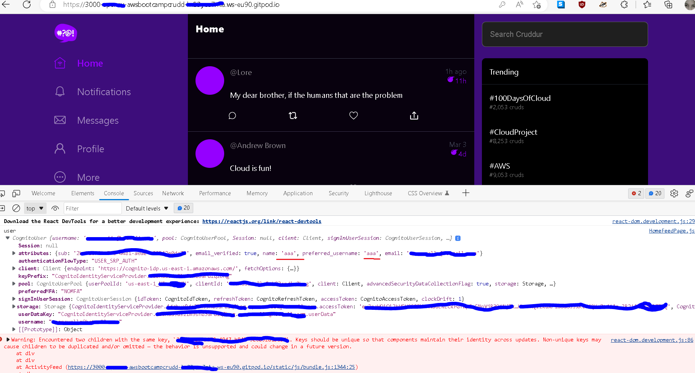
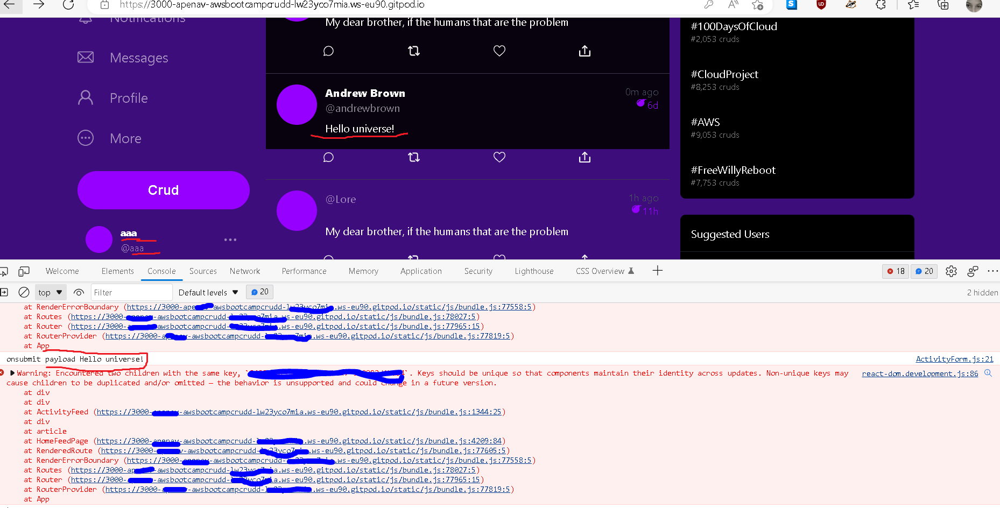

### Affected by CORS error when switched to GitHub Codespaces

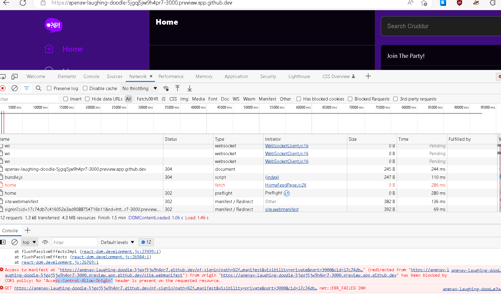

### Not working Workaround to disable X-Ray traces

Just applied to docker-compose.yml

```
AWS_XRAY_SDK_ENABLED: "False"
```

but undo because  it looks like affected by an issue similar to <https://github.com/aws/aws-xray-sdk-python/issues/330>

### Configuration of AWS Cognito

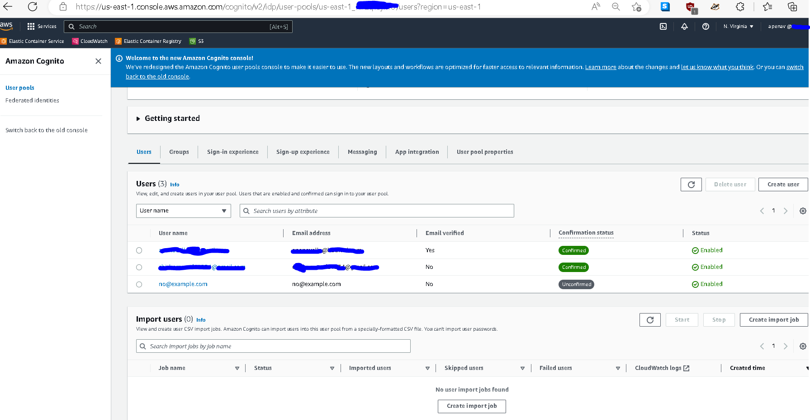

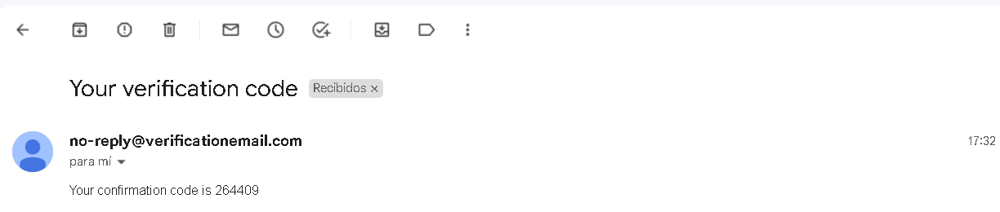
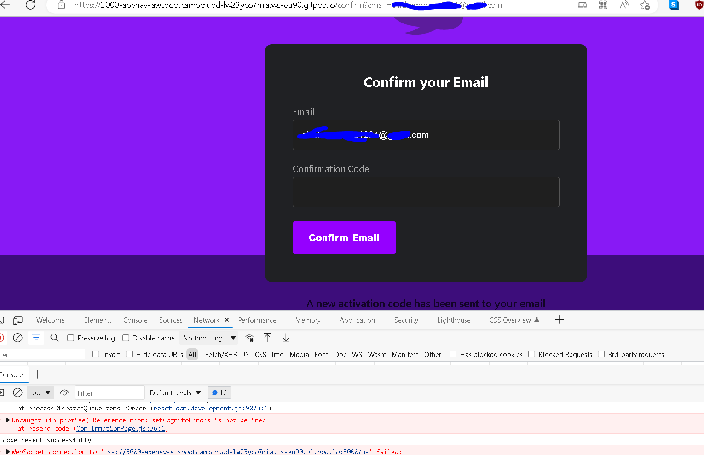
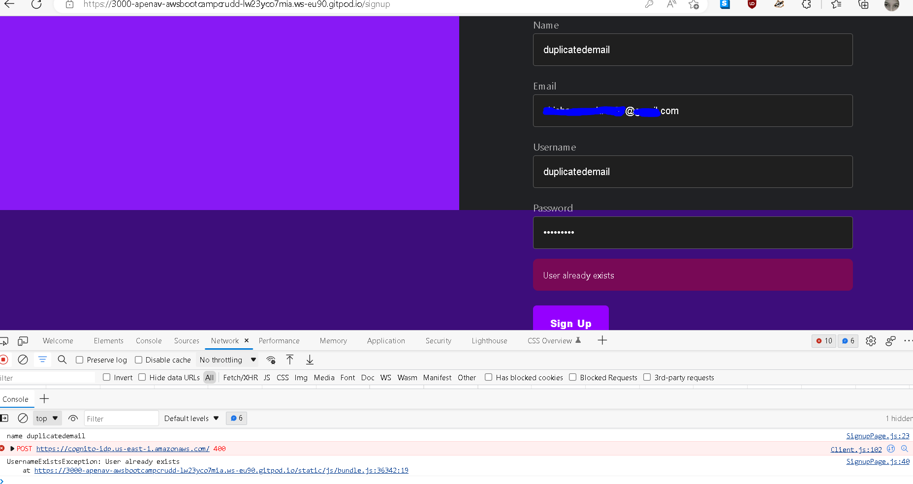

### Unsuccessful attempt to configure MFA

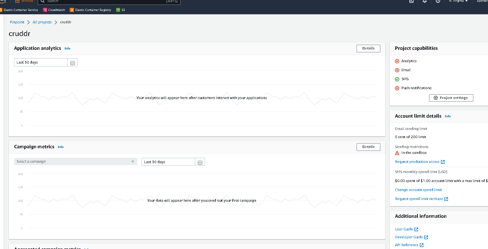
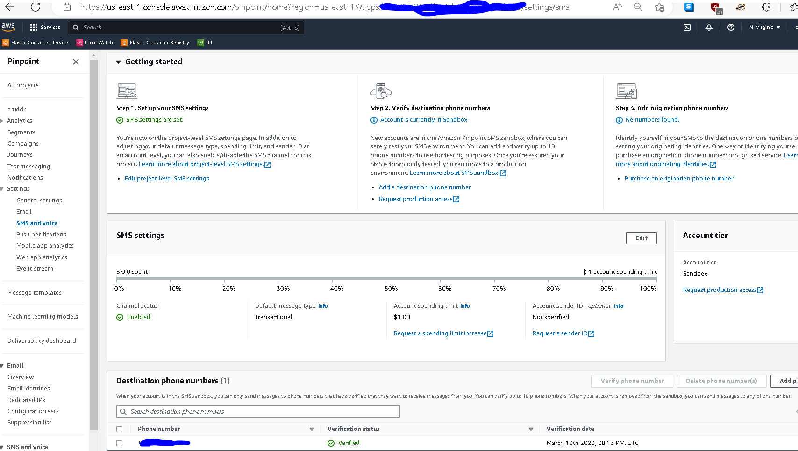
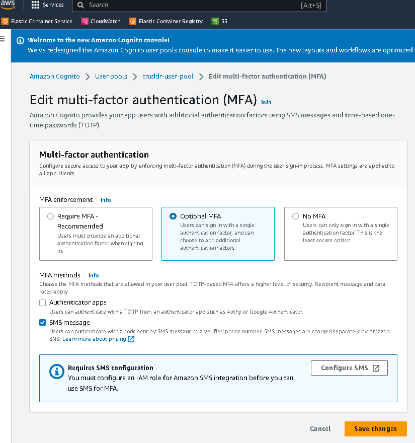
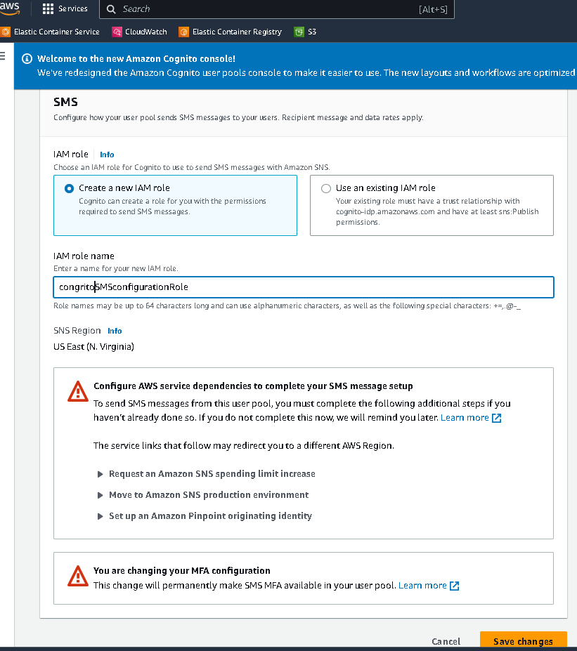
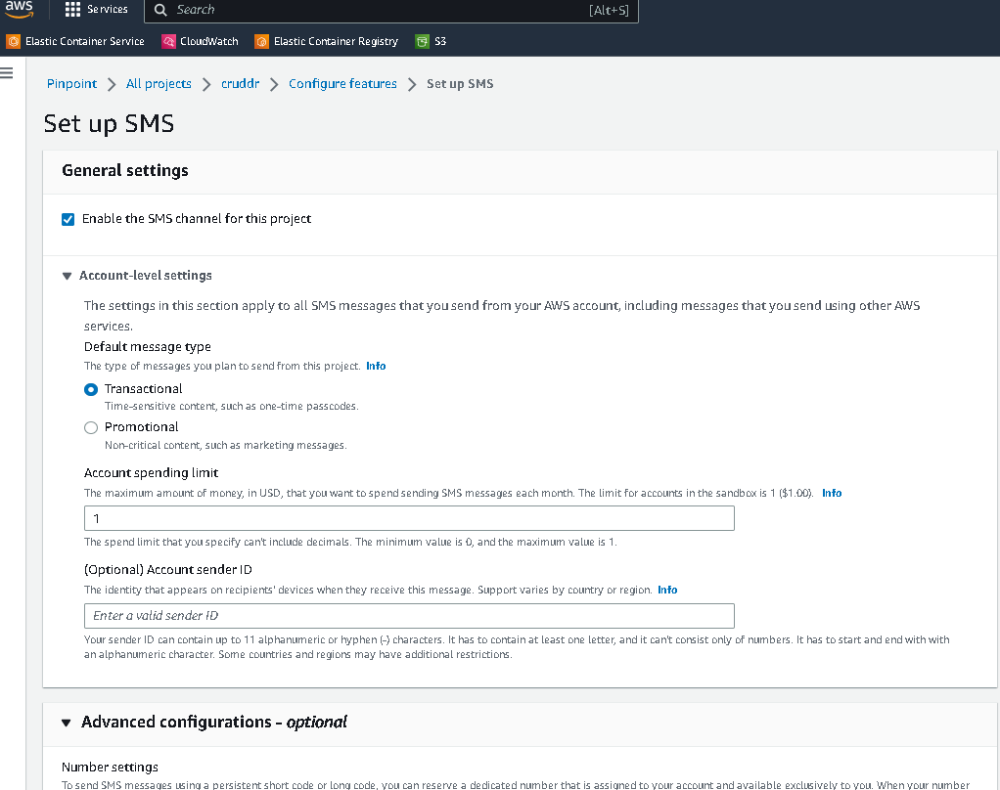

```
backend-flask                            | [2023-Mar-11 12:12] 192.168.40.10 GET http /api/activities/@andrewbrown? 200 OK
backend-flask                            | 192.168.40.10 - - [11/Mar/2023 12:12:54] "GET /api/activities/@andrewbrown HTTP/1.1" 200 -
aws-bootcamp-cruddur-2023-xray-daemon-1  | 2023-03-11T12:12:54Z [Info] Successfully sent batch of 1 segments (0.103 seconds)
backend-flask                            | [2023-03-11 12:12:58,941] ERROR in app: [2023-Mar-11 12:12] 192.168.40.10 OPTIONS http /api/activities/home? 200 OK
backend-flask                            | [2023-Mar-11 12:12] 192.168.40.10 OPTIONS http /api/activities/home? 200 OK
backend-flask                            | 192.168.40.10 - - [11/Mar/2023 12:12:58] "OPTIONS /api/activities/home HTTP/1.1" 200 -
backend-flask                            | [2023-03-11 12:12:58,985] DEBUG in app: Token is expired
backend-flask                            | Token is expired
backend-flask                            | [2023-03-11 12:12:58,985] DEBUG in app: unauthenticated
backend-flask                            | unauthenticated
backend-flask                            | [2023-03-11 12:12:58,986] INFO in home_activities: home activities
backend-flask                            | home activities
backend-flask                            | No subsegment to end.
backend-flask                            | [2023-03-11 12:12:58,987] ERROR in app: [2023-Mar-11 12:12] 192.168.40.10 GET http /api/activities/home? 200 OK
backend-flask                            | [2023-Mar-11 12:12] 192.168.40.10 GET http /api/activities/home? 200 OK
backend-flask                            | 192.168.40.10 - - [11/Mar/2023 12:12:58] "GET /api/activities/home HTTP/1.1" 200 -
aws-bootcamp-cruddur-2023-xray-daemon-1  | 2023-03-11T12:12:59Z [Info] Successfully sent batch of 2 segments (0.084 seconds)
backend-flask                            | [2023-03-11 12:13:13,747] ERROR in app: [2023-Mar-11 12:13] 192.168.40.10 GET http /api/activities/notifications? 200 OK
backend-flask                            | [2023-Mar-11 12:13] 192.168.40.10 GET http /api/activities/notifications? 200 OK
backend-flask                            | 192.168.40.10 - - [11/Mar/2023 12:13:13] "GET /api/activities/notifications HTTP/1.1" 200 -
aws-bootcamp-cruddur-2023-xray-daemon-1  | 2023-03-11T12:13:14Z [Info] Successfully sent batch of 1 segments (0.101 seconds)
backend-flask                            | [2023-03-11 12:14:02,356] ERROR in app: [2023-Mar-11 12:14] 192.168.40.10 OPTIONS http /api/activities/home? 200 OK
backend-flask                            | [2023-Mar-11 12:14] 192.168.40.10 OPTIONS http /api/activities/home? 200 OK
backend-flask                            | 192.168.40.10 - - [11/Mar/2023 12:14:02] "OPTIONS /api/activities/home HTTP/1.1" 200 -
backend-flask                            | [2023-03-11 12:14:02,404] DEBUG in app: Token is expired
backend-flask                            | Token is expired
backend-flask                            | [2023-03-11 12:14:02,404] DEBUG in app: unauthenticated
backend-flask                            | unauthenticated
backend-flask                            | [2023-03-11 12:14:02,404] INFO in home_activities: home activities
backend-flask                            | home activities
backend-flask                            | No subsegment to end.
backend-flask                            | [2023-03-11 12:14:02,405] ERROR in app: [2023-Mar-11 12:14] 192.168.40.10 GET http /api/activities/home? 200 OK
backend-flask                            | [2023-Mar-11 12:14] 192.168.40.10 GET http /api/activities/home? 200 OK
backend-flask                            | 192.168.40.10 - - [11/Mar/2023 12:14:02] "GET /api/activities/home HTTP/1.1" 200 -
aws-bootcamp-cruddur-2023-xray-daemon-1  | 2023-03-11T12:14:02Z [Info] Successfully sent batch of 2 segments (0.101 seconds)
backend-flask                            | [2023-03-11 12:14:12,069] INFO in user_activities: user activities
backend-flask                            | user activities
backend-flask                            | Setting attribute on ended span.
backend-flask                            | [2023-03-11 12:14:12,069] INFO in app: Hello Cloudwatch! from  /api/activities/@<string:handle>
backend-flask                            | Hello Cloudwatch! from  /api/activities/@<string:handle>
backend-flask                            | [2023-03-11 12:14:12,070] ERROR in app: [2023-Mar-11 12:14] 192.168.40.10 GET http /api/activities/@andrewbrown? 200 OK
backend-flask                            | [2023-Mar-11 12:14] 192.168.40.10 GET http /api/activities/@andrewbrown? 200 OK
backend-flask                            | 192.168.40.10 - - [11/Mar/2023 12:14:12] "GET /api/activities/@andrewbrown HTTP/1.1" 200 -
aws-bootcamp-cruddur-2023-xray-daemon-1  | 2023-03-11T12:14:12Z [Info] Successfully sent batch of 1 segments (0.102 seconds)
backend-flask                            | [2023-03-11 12:19:12,095] ERROR in app: [2023-Mar-11 12:19] 192.168.40.10 OPTIONS http /api/activities/home? 200 OK
backend-flask                            | [2023-Mar-11 12:19] 192.168.40.10 OPTIONS http /api/activities/home? 200 OK
backend-flask                            | 192.168.40.10 - - [11/Mar/2023 12:19:12] "OPTIONS /api/activities/home HTTP/1.1" 200 -
backend-flask                            | [2023-03-11 12:19:12,172] DEBUG in app: Token is expired
backend-flask                            | Token is expired
backend-flask                            | [2023-03-11 12:19:12,173] DEBUG in app: unauthenticated
backend-flask                            | unauthenticated
backend-flask                            | [2023-03-11 12:19:12,173] INFO in home_activities: home activities
backend-flask                            | home activities
backend-flask                            | No subsegment to end.
backend-flask                            | [2023-03-11 12:19:12,174] ERROR in app: [2023-Mar-11 12:19] 192.168.40.10 GET http /api/activities/home? 200 OK
backend-flask                            | [2023-Mar-11 12:19] 192.168.40.10 GET http /api/activities/home? 200 OK
backend-flask                            | 192.168.40.10 - - [11/Mar/2023 12:19:12] "GET /api/activities/home HTTP/1.1" 200 -
aws-bootcamp-cruddur-2023-xray-daemon-1  | 2023-03-11T12:19:13Z [Info] Successfully sent batch of 2 segments (0.104 seconds)
backend-flask                            | [2023-03-11 12:19:18,093] INFO in user_activities: user activities
backend-flask                            | user activities
backend-flask                            | Setting attribute on ended span.
backend-flask                            | [2023-03-11 12:19:18,095] INFO in app: Hello Cloudwatch! from  /api/activities/@<string:handle>
backend-flask                            | Hello Cloudwatch! from  /api/activities/@<string:handle>
backend-flask                            | [2023-03-11 12:19:18,095] ERROR in app: [2023-Mar-11 12:19] 192.168.40.10 GET http /api/activities/@andrewbrown? 200 OK
backend-flask                            | [2023-Mar-11 12:19] 192.168.40.10 GET http /api/activities/@andrewbrown? 200 OK
backend-flask                            | 192.168.40.10 - - [11/Mar/2023 12:19:18] "GET /api/activities/@andrewbrown HTTP/1.1" 200 -
aws-bootcamp-cruddur-2023-xray-daemon-1  | 2023-03-11T12:19:19Z [Info] Successfully sent batch of 1 segments (0.115 seconds)
backend-flask                            | [2023-03-11 12:19:30,545] ERROR in app: [2023-Mar-11 12:19] 192.168.40.10 OPTIONS http /api/activities/home? 200 OK
backend-flask                            | [2023-Mar-11 12:19] 192.168.40.10 OPTIONS http /api/activities/home? 200 OK
backend-flask                            | 192.168.40.10 - - [11/Mar/2023 12:19:30] "OPTIONS /api/activities/home HTTP/1.1" 200 -
backend-flask                            | [2023-03-11 12:19:30,633] DEBUG in app: authenticated
backend-flask                            | authenticated
backend-flask                            | [2023-03-11 12:19:30,633] DEBUG in app: {'sub': '9b658298-ed04-4404-b44e-eb6846b936e0', 'iss': 'https://cognito-idp.us-east-1.amazonaws.com/us-east-1_NxxxxU', 'client_id': 'xxx', 'origin_jti': 'cfd4fbe1-05c3-4531-8ae1-281fb3028111', 'event_id': '438c3d34-483f-4e52-9503-982c902e9d6f', 'token_use': 'access', 'scope': 'aws.cognito.signin.user.admin', 'auth_time': 1678537169, 'exp': 1678540769, 'iat': 1678537169, 'jti': 'b4f0e52b-ad61-4221-ae58-f0347ed8b612', 'username': 'xxx@xxx.com'}
backend-flask                            | {'sub': '9b658298-ed04-4404-b44e-eb6846b936e0', 'iss': 'https://cognito-idp.us-east-1.amazonaws.com/us-east-1_xxxxU', 'client_id': '4dohua9ds2lm9sh83ardiq2bng', 'origin_jti': 'cfd4fbe1-05c3-4531-8ae1-281fb3028111', 'event_id': '438c3d34-483f-4e52-9503-982c902e9d6f', 'token_use': 'access', 'scope': 'aws.cognito.signin.user.admin', 'auth_time': 1678537169, 'exp': 1678540769, 'iat': 1678537169, 'jti': 'b4f0e52b-ad61-4221-ae58-f0347ed8b612', 'username': 'xxx@xxx.com'}
backend-flask                            | [2023-03-11 12:19:30,633] DEBUG in app: XXX@XXX.com
backend-flask                            | XXX@XXX.com
backend-flask                            | [2023-03-11 12:19:30,633] INFO in home_activities: home activities
backend-flask                            | home activities
backend-flask                            | [2023-03-11 12:19:30,634] INFO in app: Hello Cloudwatch! from  /api/activities/home
backend-flask                            | Hello Cloudwatch! from  /api/activities/home
backend-flask                            | No subsegment to end.
backend-flask                            | [2023-03-11 12:19:30,635] ERROR in app: [2023-Mar-11 12:19] 192.168.40.10 GET http /api/activities/home? 200 OK
backend-flask                            | [2023-Mar-11 12:19] 192.168.40.10 GET http /api/activities/home? 200 OK
backend-flask                            | 192.168.40.10 - - [11/Mar/2023 12:19:30] "GET /api/activities/home HTTP/1.1" 200 -
aws-bootcamp-cruddur-2023-xray-daemon-1  | 2023-03-11T12:19:31Z [Info] Successfully sent batch of 2 segments (0.100 seconds)
```
